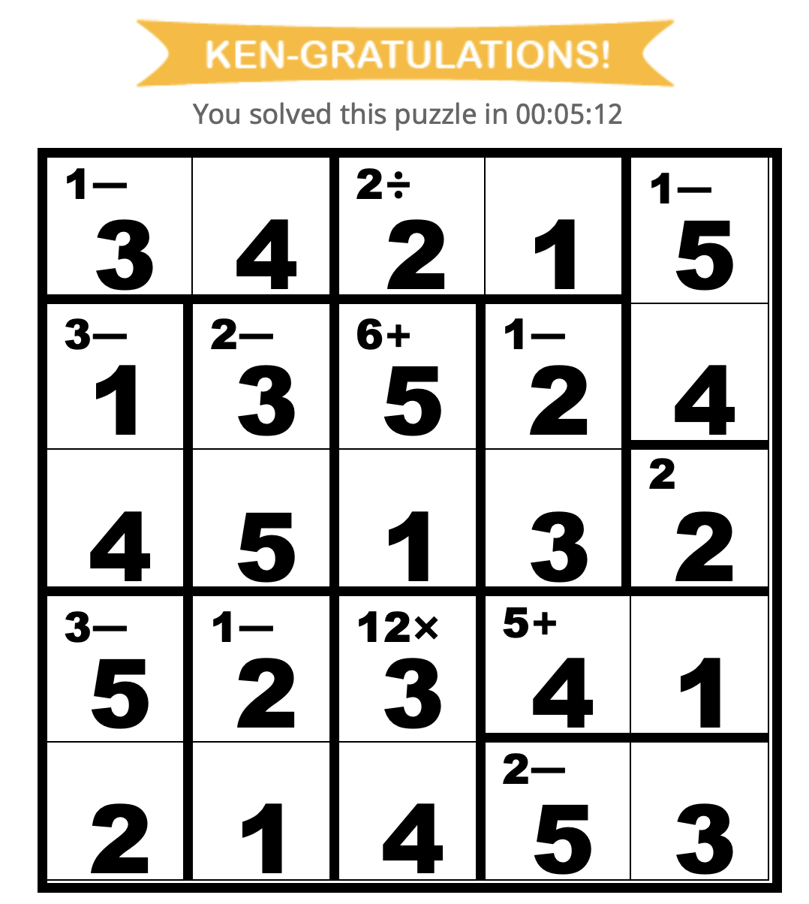

# Описание
## В файле ken_ken.py реализовал решение задач по ken-ken.
#### Методы класса KenGame
1. create_field создает пустую матрицу
2. to_matr переводит условия для cages из строки в список.
3. freebies заполняет freebies
4. check_cage проверяет, можно ли поставить проверяемое число в текущую клетку по текущему условию.   
Возвращает True, если число подходит, если клетки нет в текущем условии, если условие относится к freebies или если cage еще не полностью заполнен. Иначе возвращает False
5. mapper ищет всевозможные варианты заполнения полей, сворачивается в тупиковых ветках или при успешном дохождении до конца. Законченная версия поля лежит в kg.full_map

**Результат работы программы можно увидеть на изображениях ** 
