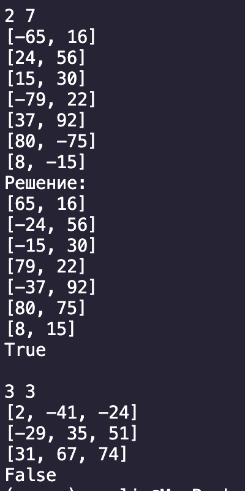

# Описание
## В файле ken_ken.py реализовал решение задач по ken-ken
### Методы класса KenGame:
1. create_field создает пустую матрицу;
2. to_matr переводит условия для cages из строки в список;
3. freebies заполняет freebies;
4. check_cage проверяет, можно ли поставить проверяемое число в текущую клетку по текущему условию.   
Возвращает True, если число подходит, если клетки нет в текущем условии, если условие относится к freebies или если cage еще не полностью заполнен. Иначе возвращает False;
5. mapper ищет всевозможные варианты заполнения полей, сворачивается в тупиковых ветках или при успешном дохождении до конца. Законченная версия поля лежит в kg.full_map.

### Результат работы программы можно увидеть на изображениях: 
  

## В файле matrix_pos.py - решение задачи на поиск матрицы с отрицательными суммами в строках и столбцах
Положительная матрица - матрица, у которой во всех столбцах и во всех строках суммы элементов положительны.  
Операция - изменение знаков каждого элемента в выбранной строке или столбце.  
В этой задаче необходимо было найти матрицу, которая не может стать положительной ни при каком наборе операций.
Программа выводит положительные матрицы в изначальном и решенном виде до тех пор, пока не будет найдена отрицательная матрица.   
Я исключил возможность одномерных матриц, так как они всегда могут стать положительными.

### Функции, используемые для решения задачи:
1. create_matrix создает матрицу случайной размерноси MxN (M + N <= 10), заполненную случайными числами из диапазона [-100:100];
2. checker проверяет, стала ли матрица положительной;
3. changer изменяет матрицу в соответствии с комбинацией к операци.  
На каждом могут прийти следующие комбинации (г - строка, в - столбец, - поменять знак):
- (г, в) - ничего не меняется  
- (-г， в) - меняется только строка  
- (г, - в) - меняется только столбец  
- (-г, -в) - меняются и стока, и столбец
4. searcher проходит по всем возможным комбинациям. Сначала идет по диагонали, а потом, если матрица не квадратная и когда одно из измерений закончилось, продолжает доходить по последнему измерению. Как только chrcker возвращает True - searcher сворачиваеся и создается новая матрица.   Если же searcher вышел запределы матрицы так и не найдя положительную матрицу - возвращается False и программа завершается.

### Результат работы программы (последние 2 матрицы):

